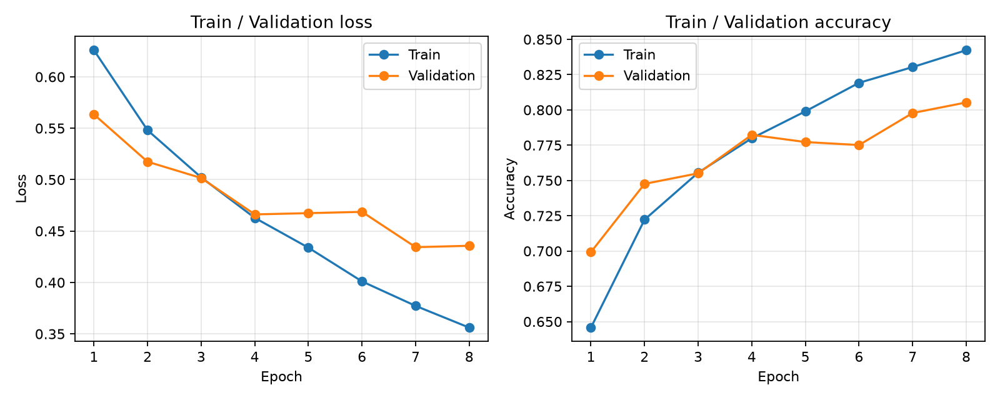
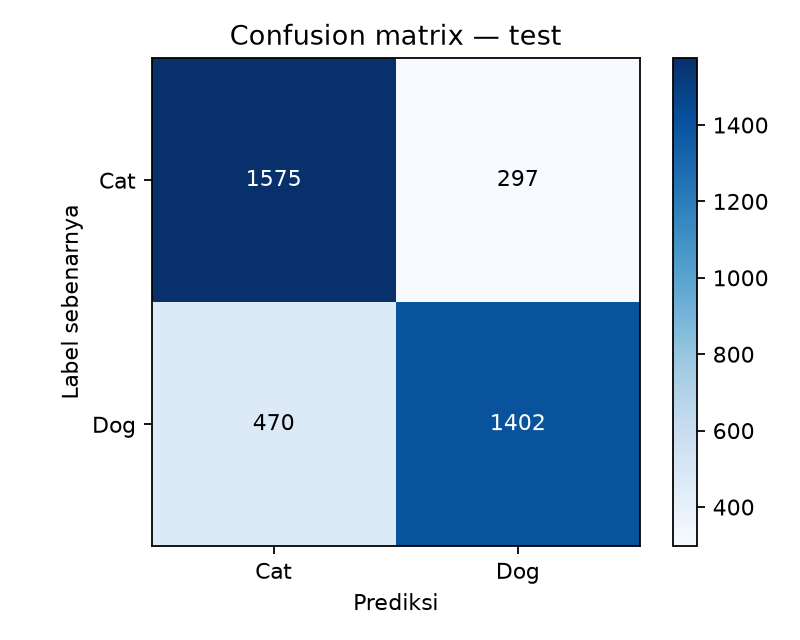
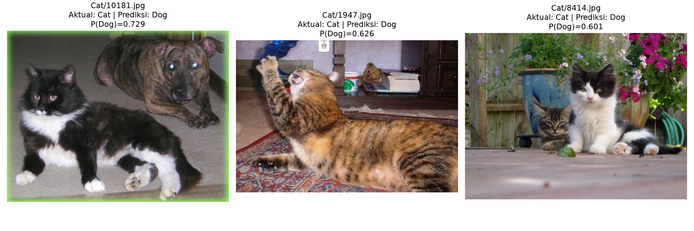

# Laporan Praktik Deep Learning Sesi 6

Dataset: [Microsoft Cats vs Dogs di Kaggle](https://www.kaggle.com/datasets/shaunthesheep/microsoft-catsvsdogs-dataset).

Tanggal unduh UTC: **2026-09-26T11:23:58.719933+00:00**. Sumber provenance: `run_config.json`.

## Pemeriksaan dataset dan preprocessing

Ditemukan {'Cat': 12500, 'Dog': 12500}; 2 gambar gagal verifikasi/decode, 26 duplikat piksel dihapus, dan 6 file dengan label konflik dikeluarkan. Tersisa 24966 gambar unik valid, dengan jumlah per kelas {'Cat': 12480, 'Dog': 12486}. File noncitra yang diabaikan: 2; peringatan decoder: 2.

Lebar asli min/median/max: {'min': 4, 'max': 500, 'median': 448.0}; tinggi: {'min': 4, 'max': 500, 'median': 375.0}. Jumlah kombinasi ukuran asli: 7514; mode asli: {'RGB': 24931, 'P': 57, 'L': 5, 'RGBA': 2, 'CMYK': 3}. Rincian file rusak dan alasan tersedia secara lokal di `dataset_audit.json`.

Gambar dikoreksi orientasi EXIF, dikonversi RGB, lalu di-resize bilinear menjadi 64×64. Resize langsung dapat mengubah aspect ratio. Pixel uint8 diubah ke float32 dan dibagi 255 sehingga berada di [0,1]. Tidak digunakan augmentasi pada baseline ini. Tensor input berbentuk N,C,H,W; Cat=0 dan Dog=1.

## Pembagian data

| Split | Cat | Dog | Total |
|---|---:|---:|---:|
| train | 8736 | 8742 | 17478 |
| validation | 1872 | 1872 | 3744 |
| test | 1872 | 1872 | 3744 |

Split stratifikasi per kelas dengan seed 42; target train/validation/test 70%/15%/15%. Pembulatan rasio dilakukan ke bawah untuk validation/test; sisanya masuk train. Manifest lengkap disimpan di `splits.json` dan hash manifest di `run_config.json`. Pemeriksaan disjoint path dan hash piksel dilakukan otomatis. Deduplikasi ini belum mendeteksi near-duplicate. Pemilihan checkpoint hanya berdasarkan validation loss. Threshold 0,5 ditetapkan sebelum training; test baru dievaluasi sekali setelah checkpoint dipilih.

## Shape dan parameter sebelum training

Untuk konvolusi dilation=1 dan groups=1: `Hout=floor((Hin+2P−K)/S)+1`, begitu juga W; `parameter=(K×K×Cin+1)×Cout`, termasuk bias. Kedua conv menggunakan K=3, P=1, S=1. Pooling menggunakan K=2, S=2, P=0 dan tidak memiliki parameter terlatih. Linear memiliki `(fitur_input+1)×fitur_output` parameter. Batch N tidak dihitung sebagai fitur atau parameter.

| Layer | Input C,H,W / fitur | Output manual | Output PyTorch | Parameter manual / PyTorch |
|---|---|---|---|---:|
| conv1 | [3, 64, 64] | [16, 64, 64] | [16, 64, 64] | 448 / 448 |
| relu1 | [16, 64, 64] | [16, 64, 64] | [16, 64, 64] | 0 / 0 |
| pool1 | [16, 64, 64] | [16, 32, 32] | [16, 32, 32] | 0 / 0 |
| conv2 | [16, 32, 32] | [32, 32, 32] | [32, 32, 32] | 4,640 / 4,640 |
| relu2 | [32, 32, 32] | [32, 32, 32] | [32, 32, 32] | 0 / 0 |
| pool2 | [32, 32, 32] | [32, 16, 16] | [32, 16, 16] | 0 / 0 |
| flatten | [32, 16, 16] | [8192] | [8192] | 0 / 0 |
| dense | [8192] | [64] | [64] | 524,352 / 524,352 |
| relu3 | [64] | [64] | [64] | 0 / 0 |
| dropout | [64] | [64] | [64] | 0 / 0 |
| output | [64] | [1] | [1] | 65 / 65 |

Total parameter: **529,505**. Semua perhitungan diverifikasi melalui dummy forward PyTorch sebelum training.

## Konfigurasi dan training

Environment: Python 3.12.10, PyTorch 2.8.0+cpu, NumPy 2.5.3, Pillow 12.3.0, Matplotlib 3.11.2. Device: cpu (x86_64); thread CPU: 4; batch size: 64; DataLoader workers: 0. Optimizer Adam, learning rate 0.001; loss BCEWithLogitsLoss; output satu logit per gambar (sigmoid hanya saat menghitung probabilitas). Dropout 0,25 di classifier, tanpa pretrained weights/transfer learning.

Epoch maksimum: 8; epoch aktual: 8; patience: 3; epoch terpilih: 7; waktu training termasuk validation setiap epoch dan penyimpanan checkpoint: 218.94 detik. Audit, cache preprocessing, dan evaluasi akhir tidak termasuk waktu training ini. Seed Python/NumPy/PyTorch dan worker diatur; deterministic algorithms aktif. Kesamaan bit demi bit antar-versi framework/perangkat tidak dijamin.

| Epoch | Train loss | Train accuracy | Validation loss | Validation accuracy | Detik |
|---:|---:|---:|---:|---:|---:|
| 1 | 0.6259 | 0.6457 | 0.5635 | 0.6993 | 28.31 |
| 2 | 0.5481 | 0.7222 | 0.5174 | 0.7476 | 22.94 |
| 3 | 0.5022 | 0.7555 | 0.5016 | 0.7551 | 26.87 |
| 4 | 0.4628 | 0.7799 | 0.4662 | 0.7823 | 28.86 |
| 5 | 0.4339 | 0.7990 | 0.4674 | 0.7772 | 35.87 |
| 6 | 0.4010 | 0.8192 | 0.4687 | 0.7751 | 34.14 |
| 7 | 0.3772 | 0.8304 | 0.4343 | 0.7978 | 23.09 |
| 8 | 0.3561 | 0.8423 | 0.4357 | 0.8053 | 18.83 |

Train metrics pada tabel dihitung selama update bobot dengan dropout aktif; validation dihitung dalam mode eval.

## Evaluasi checkpoint terpilih

| Split | Loss | Accuracy | Balanced accuracy | Macro F1 |
|---|---:|---:|---:|---:|
| Validation | 0.4343 | 0.7978 | 0.7978 | 0.7974 |
| Test | 0.4285 | 0.7951 | 0.7951 | 0.7947 |

| Split | Kelas | Precision | Recall | F1 | Support |
|---|---|---:|---:|---:|---:|
| Validation | Cat | 0.7737 | 0.8419 | 0.8063 | 1872 |
| Validation | Dog | 0.8266 | 0.7537 | 0.7885 | 1872 |
| Test | Cat | 0.7702 | 0.8413 | 0.8042 | 1872 |
| Test | Dog | 0.8252 | 0.7489 | 0.7852 | 1872 |

Baris = aktual; kolom = prediksi; urutan Cat, Dog.

## Contoh salah klasifikasi

- Contoh 1: `Cat/10181.jpg`; aktual Cat, prediksi Dog, P(Dog)=0.7290. Interpretasi visual: Gambar berisi kucing di depan sekaligus anjing yang cukup besar di belakang. Prediksi Dog sesuai keberadaan anjing dalam citra, walaupun label folder adalah Cat. Ini menunjukkan ambiguitas label biner untuk citra dengan dua kelas sekaligus; kesalahan terhadap label folder belum tentu berarti model gagal mengenali objek.
- Contoh 2: `Cat/1947.jpg`; aktual Cat, prediksi Dog, P(Dog)=0.6264. Interpretasi visual: Kucing berbaring dengan kepala menengadah, mulut terbuka, dan satu kaki terangkat di dekat wajah. Pose ini membuat kontur wajah dan telinga berbeda dari tampak depan yang umum. Corak tubuh dan karpet juga saling menyerupai; resize ke 64×64 dapat mengurangi detail wajah. Pose dan tekstur merupakan kemungkinan penyebab, bukan sebab yang telah dibuktikan melalui analisis aktivasi.
- Contoh 3: `Cat/8414.jpg`; aktual Cat, prediksi Dog, P(Dog)=0.6010. Interpretasi visual: Ada dua kucing, dengan kucing kiri sebagian tertutup kucing di depan. Background memuat banyak daun, bunga, pot, pagar, dan selang. Pada representasi 64×64, detail wajah dan batas objek dapat kurang jelas dibandingkan tekstur background. Kompleksitas scene dan kehilangan detail merupakan hipotesis visual; gambar tetap memiliki ciri kucing yang terlihat sehingga penyebab keputusan model belum dapat dipastikan.

Interpretasi di atas berasal dari inspeksi preview gambar asli. Selain keberadaan objek dan pose yang terlihat, hubungan dengan keputusan model merupakan hipotesis; belum dilakukan analisis saliency/aktivasi.

## Verifikasi kesalahan pipeline

Risiko shape mismatch: Conv2d memerlukan N,C,H,W, sedangkan array dari Pillow berbentuk H,W,C. Dataset menjalankan permute(2,0,1); batch pertama setiap epoch memeriksa bentuk N,3,H,W, rentang pixel, dan label. BCEWithLogitsLoss memerlukan bentuk logit dan target yang sama: keduanya N, bertipe float32 untuk label. Model hanya memakai squeeze(1) sehingga batch terakhir berukuran satu tetap berbentuk N. Label selain 0/1 dan logit NaN/Inf memicu error. File rusak diverifikasi dengan verify() lalu decode/load penuh sebelum split; file gagal dicatat dan dikeluarkan, tanpa mengaktifkan LOAD_TRUNCATED_IMAGES atau mengubah file asli.

## Jawaban pertanyaan analisis

Jawaban hanya nomor **1 dan 2** tersedia di [ANALISIS.md](../../ANALISIS.md). Nomor 3–6 disediakan untuk dikerjakan anggota kelompok lain.
